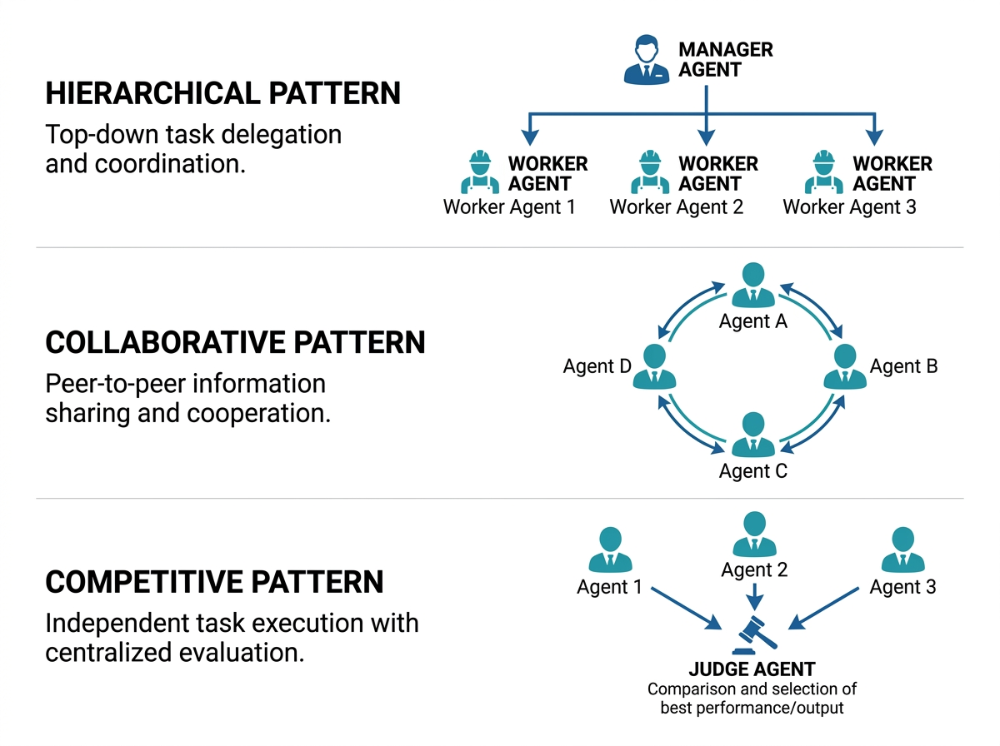
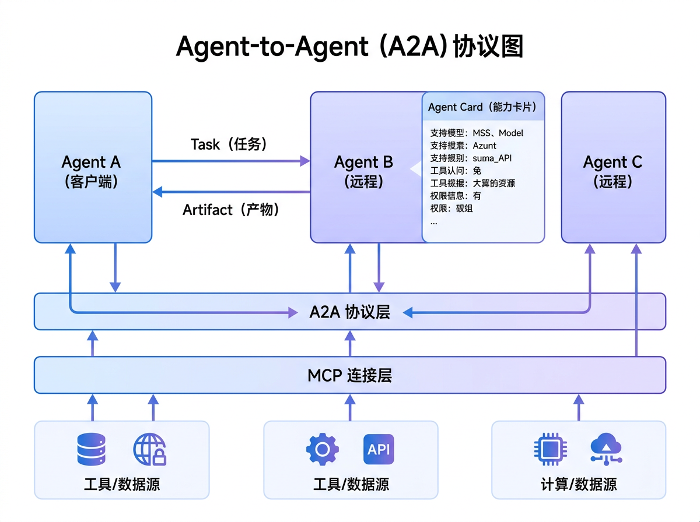

# 多 Agent 协作：分工策略、通信机制与编排模式

单个 Agent 的能力受限于其角色定位、知识范围与推理深度。当面对复杂的多维度任务时，多 Agent 协作通过角色分工与群体智慧突破了单体能力的上限，成为当前 Agent 架构设计中最重要的演进方向之一。

## 分工策略：角色化的智能体设计

多 Agent 系统的首要设计决策是**如何分配角色与职责**。常见的分工策略包括：

### 功能型分工

按照任务处理链的功能环节划分角色。例如在一个研究型 Agent 系统中，可以设计如下角色：

- **搜索 Agent**：负责信息检索与数据收集，掌握搜索工具的使用策略。
- **分析 Agent**：负责对收集到的信息进行深度分析与逻辑推理。
- **写作 Agent**：负责将分析结论组织为结构化的输出文本。
- **审核 Agent**：负责对最终输出进行事实核查与质量评估。

功能型分工的优势在于每个 Agent 可以针对其专属领域优化 prompt 设计与工具配置，形成"专业人做专业事"的效率提升。代价是 Agent 间的信息传递需要精心设计，避免上下文在交接中丢失。

### 领域型分工

按照知识领域划分角色。例如在一个金融分析系统中，宏观经济学 Agent、行业分析 Agent、财务报表 Agent 各自深耕特定领域，最终由一个综合 Agent 整合各方观点。领域型分工确保了每个 Agent 在其专域内的深度，但需要解决跨领域推理的协调问题。

### 批判型分工

设置专门的"批判者"角色，其职责不是完成任务，而是审视与挑战其他 Agent 的输出。这种分工源自"红蓝对抗"思想，通过结构化的质疑与反驳机制提升系统的推理严谨性与输出可靠性。

## 通信机制：信息如何流转

Agent 间的通信设计直接影响协作效率与信息完整性。三种核心通信机制各有适用场景：

### 共享状态（Shared State）

所有 Agent 读写一个共享的工作空间（如共享文档、任务看板或状态存储）。每个 Agent 将自己的产出写入共享空间，其他 Agent 从中读取所需信息。这一机制简化了信息流转的拓扑，但需要解决并发写入与状态冲突的问题。

### 消息传递（Message Passing）

Agent 之间通过显式的消息进行定向通信。每个 Agent 维护自己的收件箱，根据消息内容决定是否响应与如何处理。消息传递提供了更精确的通信控制，支持点对点与广播两种模式，但增加了通信协议的设计复杂度。

### 黑板系统（Blackboard）

一种介于共享状态与消息传递之间的混合机制。Agent 将中间结果发布到公共"黑板"上，其他 Agent 监控黑板中与自身职责相关的内容变化并触发响应。黑板系统适合松耦合的协作场景，每个 Agent 不需要知道其他 Agent 的存在，仅需关注黑板上的特定信号。

## 编排模式：协作的结构形态

编排模式定义了多 Agent 协作的时间结构与控制流向，三大经典模式各有适用场景：

### 顺序编排（Sequential）

Agent 按照固定顺序依次执行，前一个 Agent 的输出作为后一个 Agent 的输入。这是最简单的编排模式，适用于**步骤间有严格依赖**的线性流程，如"搜索 → 分析 → 写作 → 审核"。顺序编排的可控性最高，但灵活性最低——任何环节的阻塞都会导致整体停滞。

### 并行编排（Parallel）

多个 Agent 同时启动，各自独立处理分配的子任务，最终由一个汇总 Agent 整合所有结果。并行编排显著缩短了处理时间，适用于**子任务间无强依赖**的场景，如同时对三个不同数据源进行独立分析。关键挑战在于结果整合——如何将不同 Agent 的异构输出合并为一致的最终答案。

### 层级编排（Hierarchical）

引入管理层次结构。顶层 Manager Agent 负责任务分解与子任务分配，中层 Supervisor Agent 管理一组执行 Agent 的协作，底层 Worker Agent 执行具体操作。层级编排适合**任务复杂度高、子任务间有复杂依赖**的场景，如大型项目的管理。Manager Agent 的规划质量决定了整体效率，而层级过多可能导致信息在传递中衰减。

## 实践中的混合编排

现实系统往往采用混合编排策略。一个典型的模式是：Manager Agent 使用层级编排进行全局任务分解与分配，被分配的子任务组内部采用并行编排加速执行，而需要严格顺序的子任务链则采用顺序编排保障一致性。编排模式的选择应当基于任务依赖图的分析——子任务间的依赖关系决定了哪些可以并行、哪些必须顺序、哪些需要层级管理。

> 💡 **设计原则**：分工策略应追求"高内聚低耦合"——每个 Agent 的职责边界清晰，接口定义简洁。通信机制应匹配编排模式——顺序编排适合消息传递，并行编排适合共享状态，层级编排适合黑板系统。

## A2A：Agent 间通信协议

多 Agent 协作的下一个瓶颈不是"如何设计角色"，而是"如何让不同框架、不同厂商开发的 Agent 互相理解"。Google 于 2025 年推出的 A2A（Agent-to-Agent）协议，正是为解决这一互操作性问题而生。

### A2A 的核心概念

A2A 协议围绕三个核心抽象构建：

**Agent Card（能力卡片）**
每个 Agent 发布一张 JSON 格式的能力卡片，声明自己的身份、支持的任务类型、输入输出格式、认证要求和端点地址。这相当于 Agent 世界的"名片"——其他 Agent 在协作前，先通过 Agent Card 判断对方是否具备完成任务的能力。

**Task（任务）**
A2A 中的基本工作单元。一个 Task 包含目标描述、输入数据、优先级和生命周期状态。Task 可以同步执行（阻塞等待结果）或异步执行（通过回调或轮询获取状态）。这种设计让不同 Agent 之间的协作有了统一的"工作订单"格式。

**Artifact（产物）**
Task 执行完成后返回的结构化结果。Artifact 可以是文本、代码、文件引用或嵌套的子 Task 列表。A2A 通过标准化的产物格式，确保调用方 Agent 能正确解析和使用被调用 Agent 的输出。

### A2A 与 MCP 的互补关系

A2A 和 MCP 解决的是不同层次的问题：

- **MCP 解决 Agent 与工具的连接**——标准化 Agent 如何调用数据库、搜索引擎、代码执行环境等"非智能"资源
- **A2A 解决 Agent 与 Agent 的协作**——标准化智能体之间如何分配任务、交换信息、协同完成复杂目标

**类比**：MCP 是 Agent 的"工具腰带"（让 Agent 能用锤子、螺丝刀），A2A 是 Agent 的"团队协作协议"（让多个工人知道谁负责什么、如何交接成果）。

### 对工程实践的影响

A2A 协议的成熟将带来两个结构性变化：

1. **Agent 生态从"框架孤岛"走向"联邦协作"**：基于 LangGraph 开发的 Agent 可以直接调用基于 AutoGen 开发的 Agent 的能力，无需统一技术栈
2. **"Agent 即服务"（Agent-as-a-Service）成为可能**：企业可以将内部 Agent 封装为 A2A 端点，对外提供标准化服务——就像今天的 REST API，但参与方是自主决策的智能体

当前 A2A 仍处于早期阶段，主要挑战包括：跨组织 Agent 的身份认证与授权、Task 执行的最终一致性保障、以及 Agent Card 的语义搜索与动态发现机制。对 Agent 工程师而言，当下最务实的准备是：**在设计多 Agent 系统时，将通信层抽象为可插拔的协议接口**，未来可以平滑迁移到 A2A 或其他标准化协议。

> 💡 **设计原则**：无论使用 A2A 还是自定义通信机制，多 Agent 系统的核心挑战始终是"语义一致性"——确保不同 Agent 对同一概念的理解一致。协议标准化解决了"语法"层面的互操作，但"语义"层面的对齐仍需通过共享 Schema 和领域本体来保障。

---

## 本章小结

| 维度 | 顺序编排 | 并行编排 | 层级编排 |
|------|---------|---------|---------|
| **结构** | 线性链式 | 多分支并行 | 树状管理 |
| **通信** | 消息传递 | 共享状态 | 黑板系统 |
| **适用场景** | 依赖链明确的任务 | 子任务独立的任务 | 复杂度高的项目 |
| **核心风险** | 单点故障 | 结果整合困难 | 信息衰减 |

**设计原则**：2-3 个 Agent 的简单协作往往比 7-8 个 Agent 的复杂编排更实用；多 Agent 调试成本远高于单 Agent，先验证单 Agent 可行性再拆分。

---

> 📖 **延伸阅读**
>
> 1. [AutoGen: Enabling Next-Gen LLM Applications via Multi-Agent Conversation](https://arxiv.org/abs/2308.08155) —— 多 Agent 对话框架原论文
> 2. [CrewAI Documentation](https://docs.crewai.com/) —— 角色驱动多 Agent 框架
> 3. [MetaGPT: Meta Programming for Multi-Agent Collaborative Framework](https://arxiv.org/abs/2308.00352) —— 多 Agent 协作原论文
> 4. [LangGraph Multi-Agent](https://langchain-ai.github.io/langgraph/tutorials/multi_agent/) —— 官方多 Agent 教程