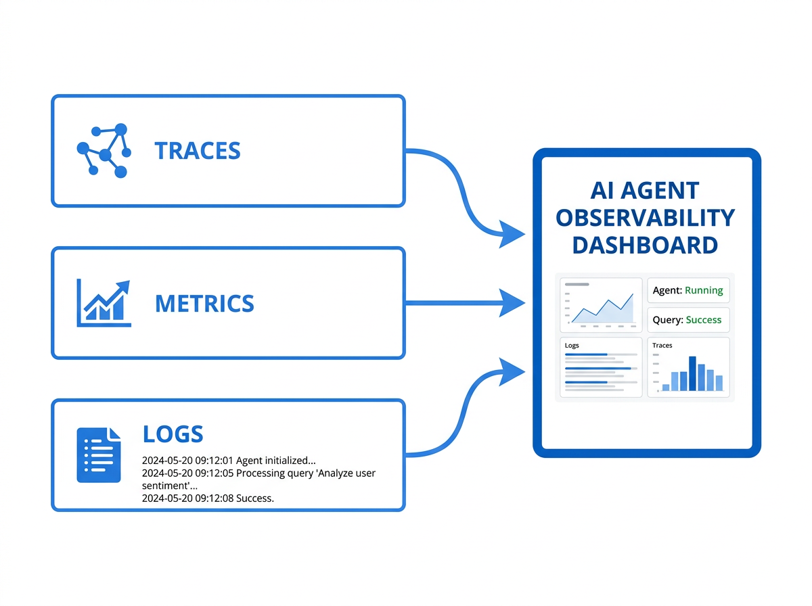

# 可观测性



Agent 的推理链路涉及模型决策、工具调用、上下文拼接等多个环节，出了问题时"看不见哪里错了"是最常见的困境。可观测性（Observability）是 Agent 工程化的基础设施——没有它，调试靠猜测、优化靠直觉、评估靠感觉。本章讲解 Trace 链路追踪、调试工具、效果评估指标以及 Langfuse/Phoenix 等平台的实战接入。

## Trace 链路追踪

### 什么是 Agent Trace？

一次 Agent 交互可能包含：用户意图解析 → RAG 检索 → 检索结果筛选 → 工具调用决策 → 工具执行 → 结果整合 → 最终回答生成。Trace 就是这条链路上每一步的完整记录。

每个 Trace 包含以下要素：

- **Trace ID**：一次完整交互的唯一标识。
- **Span**：链路中的每一步操作，每个 Span 有自己的 ID、父 Span ID、开始/结束时间。
- **输入/输出**：每一步的完整输入和输出内容（包括 LLM 的 Prompt 和 Response）。
- **元数据**：模型名称、Token 用量、工具名称、耗时、状态码等。

### Trace 的层级结构

```
Trace (用户问: "我的订单 ORD-123456 到哪了？")
├── Span: intent_parsing (耗时: 0.3s, 模型: gpt-4o-mini)
│   └── output: {intent: "查询物流", entities: {order_id: "ORD-123456"}}
├── Span: rag_retrieval (耗时: 1.2s, 工具: vector_search)
│   ├── input: {query: "ORD-123456 物流状态", top_k: 5}
│   └── output: {results: [...5条文档...], scores: [0.92, 0.87, ...]}
├── Span: reranking (耗时: 0.4s, 工具: bge-reranker)
│   └── output: {top_3: [...精选3条...]}
├── Span: tool_call_decision (耗时: 0.5s, 模型: gpt-4o)
│   └── output: {tool: "query_logistics", args: {order_id: "ORD-123456"}}
├── Span: tool_execution (耗时: 2.1s, 工具: query_logistics)
│   └── output: {status: "运输中", location: "上海转运中心", eta: "2024-03-20"}
└── Span: response_generation (耗时: 1.8s, 模型: gpt-4o)
    └── output: "您的订单 ORD-123456 目前在上海转运中心..."
```

### Trace 的实现方式

**手动打点**：在 Agent 执行逻辑的关键节点插入 Span 记录代码。适用于简单 Agent 或需要精细控制的场景。

**框架集成**：LangChain/LlamaIndex 等框架支持自动 Trace 生成，只需配置回调 handler。但自动 Trace 的粒度可能不够细（如不会记录 RAG 检索的中间排序过程）。

**OpenTelemetry 标准**：采用 OTel 的 Trace/Span 语义和协议，与通用可观测性基础设施（Jaeger、Zipkin、Prometheus）兼容。适合已有 OTel 体系的技术团队。

推荐做法：**框架自动 Trace + 关键节点手动补打 Span**，兼顾覆盖度和粒度。

## 调试工具

### 交互式调试场景

Agent 出问题时，开发者需要：

1. **回放完整链路**：看到每一步的输入输出，理解 Agent 的推理路径。
2. **定位问题节点**：是检索召回不够、还是模型推理出错、还是工具返回了错误数据？
3. **修改并重试**：调整某一步的输入（如修改 Prompt、更换检索结果），重新执行后续步骤，观察结果变化。

### 本地调试工具

- **LangChain Debugger**：LangChain 内置的 debug 模式，逐步打印输入输出。适合开发阶段快速定位问题，但信息是文本日志形式，缺乏结构化视图。
- **LlamaIndex Logger**：类似功能，记录检索和生成的详细过程。
- **自建 Trace Viewer**：将 Trace 数据存入本地 JSON/数据库，用 Web UI 可视化展示。适合需要定制化调试体验的团队。

### 生产环境调试

生产环境的调试需求与开发环境不同——你不能直接修改线上数据重试，但需要：

- **实时监控**：异常 Trace 的自动告警（如某步骤耗时超阈值、工具错误率飙升）。
- **趋势分析**：不同时间段 Agent 效果是否变化（可能与模型更新、数据变更有关）。
- **用户反馈关联**：将用户对回答的"点赞/踩"反馈与 Trace 关联，定位哪些推理路径导致了不好的回答。

## 效果评估指标

### 过程指标

过程指标衡量 Agent 执行链路中各环节的质量：

- **工具调用成功率**：`成功调用次数 / 总调用次数`。低于 95% 说明工具稳定性有问题。
- **平均步骤数**：完成一个任务平均执行多少步。步骤数过多可能说明 Agent 设计不够高效。
- **检索召回率**：RAG 步骤中正确文档被召回的比例。
- **Token 效率**：完成同等质量任务所消耗的 Token 数。越低越好。

### 结果指标

结果指标衡量 Agent 最终输出的质量：

- **任务完成率**：Agent 的回答是否完整解决了用户的问题？可通过人工评分或自动化评估（用另一个 LLM 评判）。
- **回答准确性**：事实性问题的回答是否正确？构建事实性测试集，比对 Agent 回答与标准答案。
- **回答完整性**：是否覆盖了问题的所有方面？用 LLM-as-Judge 评估覆盖度。
- **用户满意度**：最直接的指标——用户评分（1-5 星）或点赞率。

### 成本指标

- **单次交互成本**：一次完整交互的 API 调用费用。`总 Token 数 × Token 单价`。
- **成本/效果比**：单位成本对应的任务完成率。优化目标不是单纯降低成本，而是提高成本/效果比。

## Langfuse 与 Phoenix 实战接入

### Langfuse

Langfuse 是开源的 LLM 可观测性平台，提供 Trace 可视化、评估、Prompt 管理等功能。

**接入步骤**：

```python
from langfuse import Langfuse

langfuse = Langfuse(
    public_key="pk-xxx",
    secret_key="sk-xxx",
    host="https://cloud.langfuse.com"  # 或自部署地址
)

# 创建 Trace
trace = langfuse.trace(
    name="order_query_agent",
    user_id="user-123",
    metadata={"environment": "production"}
)

# 创建 Span
span = trace.span(name="rag_retrieval", input={"query": "..."})
# ... 执行检索 ...
span.end(output={"results": [...]})

# 创建 Generation Span（记录 LLM 调用）
generation = trace.generation(
    name="response_generation",
    model="gpt-4o",
    input=prompt,
    output=response,
    usage={"prompt_tokens": 150, "completion_tokens": 200, "total_tokens": 350}
)
```

Langfuse 的核心价值：

- **Trace 可视化**：Web UI 展示完整链路树，每一步的输入输出清晰可见。
- **评估评分**：支持人工评分和 LLM-as-Judge 自动评分，关联到具体 Trace。
- **成本追踪**：自动计算每次交互的 Token 用量和费用。
- **Prompt 版本管理**：不同版本的 Prompt 效果对比。

### Arize Phoenix

Phoenix 是 Arize 开源的 LLM 可观测性工具，轻量且支持本地运行。

**接入步骤**：

```python
import phoenix as px

# 启动本地 Phoenix 服务
px.launch_app()

# 使用 LlamaIndex 自动集成
from llama_index.core import set_global_handler
set_global_handler("arize_phoenix")

# 此后所有 LlamaIndex 操作自动记录到 Phoenix
```

Phoenix 的特点：

- **零配置启动**：一条命令启动本地服务，适合快速验证。
- **Embedding 可视化**：展示 Embedding 空间中的聚类分布，帮助发现检索质量问题的根源。
- **与 LlamaIndex 深度集成**：自动 Trace 生成，无需手动打点。

### 选型建议

- **快速验证/小团队**：Phoenix，启动快、够用。
- **生产级/需要评估体系**：Langfuse，功能更全面，社区更活跃。
- **已有 OTel 体系**：用 OTel SDK 生成 Trace，接入现有 Grafana/Jaeger 体系。
---

## 本章小结

| 可观测性维度 | 核心组件 | 关键指标 |
|-------------|---------|---------|
| **链路追踪** | Span → Trace → 调用树 | 推理步数、工具调用次数、端到端延迟 |
| **指标监控** | 过程指标 + 结果指标 + 成本指标 | 成功率、满意度、Token 消耗 |
| **日志管理** | 结构化日志 + 关联 ID | 错误率、异常模式、用户投诉 |
| **平台选择** | Langfuse / Phoenix / 自建 | 按团队规模与预算选择 |

**核心原则**：不可观测的系统不可优化——在生产环境中，Agent 的每个决策都必须留下痕迹。

---

> 📖 **延伸阅读**
>
> 1. [OpenTelemetry](https://opentelemetry.io/) —— 开源可观测性标准
> 2. [Langfuse Documentation](https://langfuse.com/docs) —— LLM 可观测性平台
> 3. [Arize Phoenix](https://docs.arize.com/phoenix) —— LLM 追踪与评估平台
> 4. [Grafana + Prometheus](https://grafana.com/solutions/prometheus/) —— 指标监控经典组合
