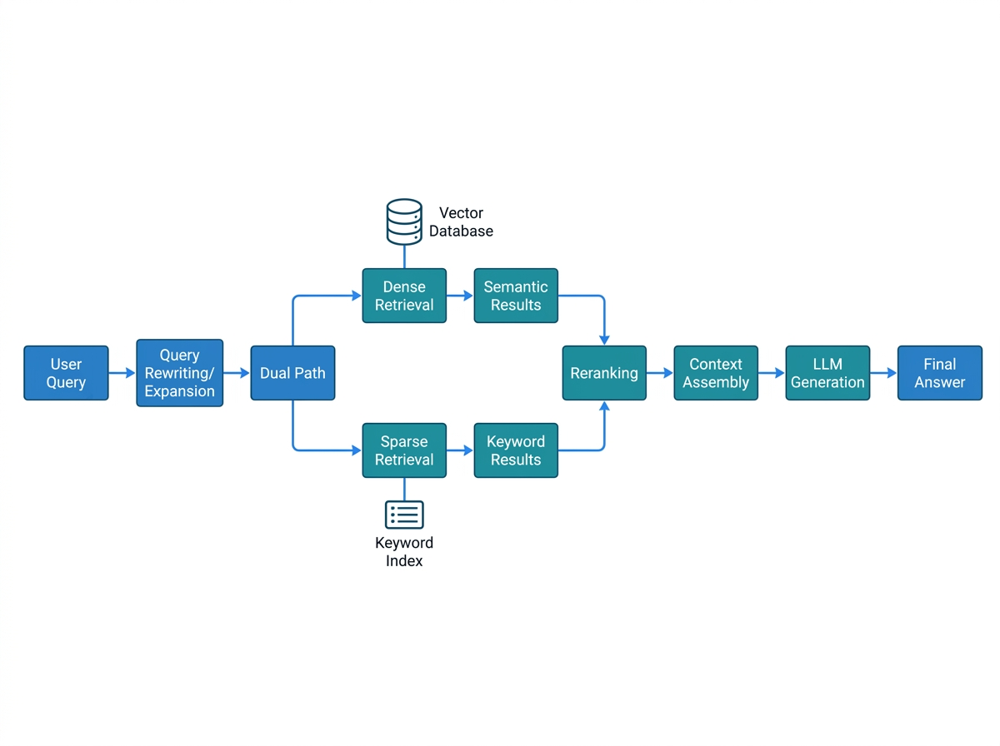

# RAG 工程化

RAG（Retrieval-Augmented Generation）是 Agent 获取外部知识的核心手段。但在生产环境中，"能检索"和"检索得好"之间差距巨大——召回率不足、相关性排序错误、上下文窗口浪费，每一个问题都会直接拉低 Agent 的最终回答质量。本章从检索策略、Embedding 选型、重排序、质量评估到常见坑点，系统讲解 RAG 工程化的关键实践。

## 检索策略设计

### 基础策略：向量相似度检索

最基础的 RAG 策略是将文档分块后生成 Embedding，查询时用余弦相似度召回 Top-K。这种方案实现简单，但在以下场景表现不佳：

- **语义相似但无关**：用户问"退款政策"，召回"退货流程"——语义相近但答案不同。
- **多义词歧义**："苹果"可能指水果或公司，向量空间中两者距离可能很近。
- **长文档信息稀释**：一个大块中包含多个话题，Embedding 被平均化后丢失细节。

### 进阶策略：混合检索

混合检索结合向量检索与关键词检索（如 BM25），取各自优势：

- **向量检索**擅长语义匹配，能理解"如何取消订单"与"退订流程"的关联。
- **BM25**擅长精确匹配，对产品型号、错误码等关键词场景召回更精准。

实际做法是分别检索后做 **Reciprocal Rank Fusion（RRF）** 融合排序，公式为 `score = sum(1 / (k + rank_i))`，其中 k 通常取 60。这比简单拼接或加权平均更鲁棒。

### 更细粒度：分层检索

对于知识库规模大（百万级以上文档）的场景，建议分层检索：

1. **第一层**：在文档级别召回相关文档（可用轻量 Embedding 或关键词索引）。
2. **第二层**：在召回文档的段落级别做精确检索。

这种"先筛文档再筛段落"的策略显著减少无效计算，同时提升上下文利用率。

## Embedding 选型

Embedding 模型的选择直接影响检索质量，需从三个维度评估：

| 维度 | 关注点 |
|------|--------|
| **语义理解能力** | 同义词、否定、多义词的处理质量 |
| **维度与性能** | 维度越高表达力越强，但索引和检索成本也越高 |
| **多语言支持** | 中英混合文档场景下是否兼顾两种语言 |

**常见选项**：

- **OpenAI text-embedding-3-large**：3072 维，语义理解强，适合中英文混合场景，但成本较高。
- **text-embedding-3-small**：1536 维，性价比好，大多数场景够用。
- **BGE-M3（BAAI）**：开源模型，支持多语言和多粒度检索，适合私有化部署。
- **GTE-Qwen2**：阿里开源，中文表现优异，适合中文为主的知识库。

选型建议：先在业务数据集上做 **小规模召回率测试**（50-200 条查询），不要仅看模型排行榜——排行榜数据集与你的业务数据分布很可能不同。

## 重排序（Reranking）

向量检索的 Top-K 结果往往包含"看起来相关但实际无关"的段落。重排序模型用交叉编码器（Cross-Encoder）对 query 与每个候选段落做精细相关性打分，显著提升最终输出质量。

**推荐模型**：

- **Cohere Rerank**：API 服务，效果好且无需本地部署，适合快速验证。
- **BGE-Reranker-v2-M3**：开源，支持多语言，适合私有化场景。
- **Jina Reranker v2**：开源，速度快，适合对延迟敏感的场景。

**实践要点**：

1. 先用向量检索召回 20-50 条候选，再用 Reranker 精选 5-10 条送入 LLM——"宽召回窄精选"。
2. Reranker 的推理成本比向量检索高得多，不要对所有段落都做重排序。
3. 注意 Reranker 的最大输入长度限制，超长段落需截断后再排序。

## 质量评估指标

RAG 系统需要量化评估才能持续优化，核心指标包括：

- **召回率（Recall）**：在所有相关文档中，检索命中了多少？`Recall = 命中相关数 / 总相关数`。这是最根本的指标——如果相关文档没被召回，后续一切优化都无效。
- **精确率（Precision）**：召回结果中有多大比例是相关的？`Precision = 命中相关数 / 总召回数`。精确率低意味着上下文窗口被无关内容浪费。
- **MRR（Mean Reciprocal Rank）**：第一个相关结果出现在第几位？MRR = 1/排名 的均值。反映检索排序质量。
- **NDCG（Normalized Discounted Cumulative Gain）**：考虑排序位置的加权评估，越相关的排在越前面得分越高。
- **上下文利用率**：送入 LLM 的检索内容中，实际有多少被用于生成回答？可以通过分析 LLM 输出与检索内容的引用关系来估算。

**评估数据集构建**：从真实用户查询中抽样 100-500 条，人工标注每条查询的正确答案段落，构成评估基准集。定期跑自动化评测，追踪指标变化。

## 常见坑点

### 分块策略不当

分块大小直接影响检索质量。块太大导致信息稀释，块太小丢失上下文。经验值：**512-1024 tokens** 为通用起点，法律/合同等长文本场景可用 1500-2000，问答对等短文本场景用 200-400。

更关键的是 **分块边界**——不要在段落中间硬切，应按语义边界（标题、段落、章节）分割。推荐使用 `semantic-chunking` 策略：计算相邻句子的 Embedding 相似度，低于阈值处切分。

### 忽略元数据过滤

纯向量检索不考虑文档的时效性、权限、类别等元数据。实际场景中：

- 用户问"最新退款政策"，向量检索可能召回三年前的旧政策。
- 用户只有 A 类权限，但检索返回了 B 类受限文档。

**解决方案**：在向量数据库中存储元数据字段，检索时附加过滤条件（如 `date > 2024-01-01 AND permission = "public"`）。Milvus、Pinecone、Weaviate 都支持此功能。

### 上下文窗口浪费

把所有 Top-K 结果塞入 Prompt 是常见做法，但 LLM 上下文窗口有限（4K-128K tokens）。无关段落挤占空间，反而降低回答质量。**建议动态调整送入段数**：对 Reranker 打分低于阈值的段落直接丢弃，宁可少送也不送噪声。

### 更新与一致性

知识库文档更新后，向量索引必须同步更新。否则用户查询会命中已过时的内容。建立 **文档更新 → 自动重新 Embedding → 索引更新** 的流水线，并设置定期全量重建索引的兜底机制。
---

## 本章小结

| 维度 | 关键决策 |
|------|---------|
| **检索策略** | 稠密检索（语义）+ 稀疏检索（关键词）→ 混合检索最优 |
| **嵌入模型** | 通用场景选 text-embedding-3，垂直领域选微调模型 |
| **评估指标** | Recall@K、Precision@K、NDCG@K，构建自定义测试集 |
| **优化方向** | 语义分块 > 固定分块；重排序 > 单路检索；元数据过滤 > 全量扫描 |

**RAG 成功公式**：优质文档 → 智能分块 → 混合检索 → 重排序 → 上下文压缩 → 答案生成

---

> 📖 **延伸阅读**
>
> 1. [Retrieval-Augmented Generation for Large Language Models: A Survey](https://arxiv.org/abs/2312.10997) —— RAG 技术综述
> 2. [LangChain RAG Tutorial](https://python.langchain.com/docs/tutorials/rag/) —— 官方 RAG 实现教程
> 3. [Embedding Models Leaderboard](https://huggingface.co/spaces/mteb/leaderboard) —— MTEB 嵌入模型排行榜
> 4. [RAGFlow 开源项目](https://github.com/infiniflow/ragflow) —— 深度文档理解的 RAG 引擎
