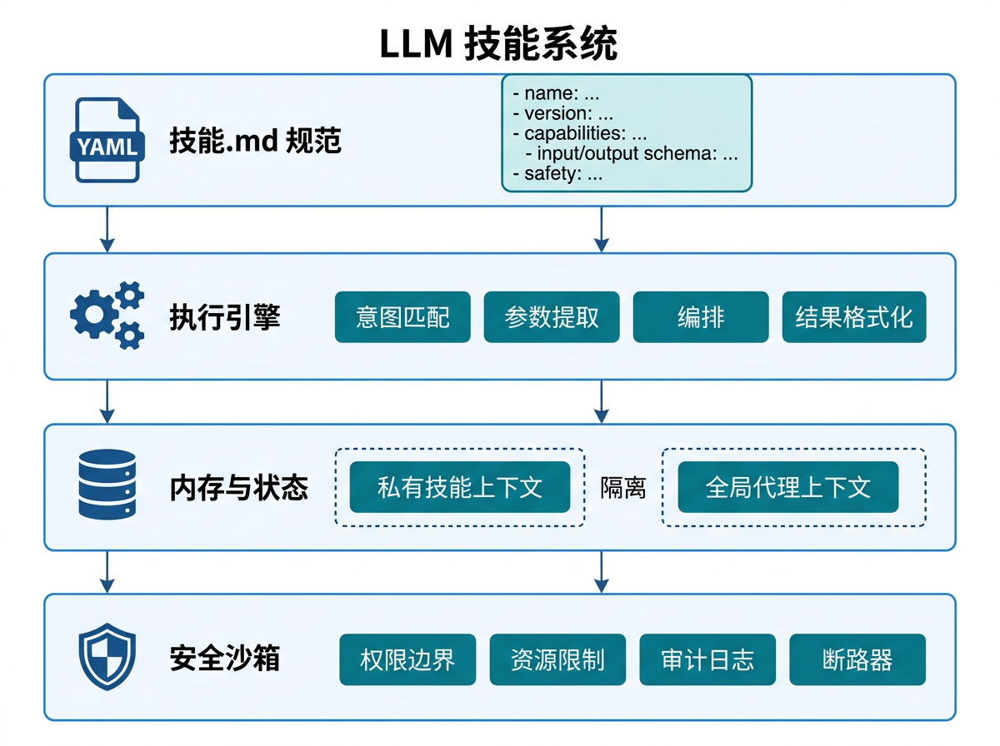

# 大模型 Skill 系统

2026 年，Agent 开发范式正在从"围绕模型写代码"转向"围绕 Skill 组装能力"。Skill（技能）是可独立定义、动态加载、组合复用的能力单元——它让 Agent 无需重新训练就能掌握新能力，也让开发者像搭积木一样构建复杂应用。本章系统讲解 Skill 的架构设计、获取方法、生态治理与工程实践。

## 什么是 Skill

Skill 是 Agent 与外部世界交互的**模块化能力包**。与早期 Function Calling 中零散的工具定义不同，Skill 包含完整的语义描述、输入输出规范、执行逻辑、错误处理策略和安全边界——它是一个自包含的、可独立分发和安装的能力模块。

### Skill vs Tool vs MCP Server

| 维度 | Tool（工具） | MCP Server | Skill（技能） |
|------|------------|-----------|-------------|
| **粒度** | 单个函数调用 | 一组工具+资源 | 完整业务流程 |
| **语义** | 仅名称和参数描述 | 协议标准化接口 | 自然语言能力描述 |
| **状态** | 无状态 | 可维护会话状态 | 可维护内部状态与记忆 |
| **组合性** | 需外部编排 | 需外部编排 | 支持 Skill 嵌套与组合 |
| **示例** | `get_weather(city)` | 天气查询服务 | "旅行规划助手"（含航班+酒店+天气） |

**核心洞察**：Tool 是"原子操作"，MCP Server 是"工具集合"，而 Skill 是"完整能力"——它知道何时调用哪些工具、如何处理中间结果、如何在失败时降级。

## Skill 架构设计



一个标准的 Skill 包含四个核心组件：

### 1. SKILL.md 规范

```yaml
skill:
  name: travel_planner
  version: 1.2.0
  description: |
    根据用户预算和偏好，规划完整旅行行程。
    能力包括：航班搜索、酒店预订、景点推荐、天气查询。
  capabilities:
    - flight_search
    - hotel_booking
    - attraction_recommendation
    - weather_query
  input_schema:
    destination: string
    budget: number
    dates:
      start: date
      end: date
    preferences:
      hotel_stars: number
      transport_type: [flight, train, bus]
  output_schema:
    itinerary: array
    total_cost: number
    booking_links: array
  safety:
    max_budget_limit: 50000
    required_confirmations: [hotel_booking, flight_booking]
    blocked_destinations: ["restricted_area_1"]
```

SKILL.md 的设计遵循**渐进式披露**原则——模型首先读取高层描述判断是否需要该 Skill，只有在确认需要时才加载完整的参数规范和执行逻辑。

### 2. 执行引擎

Skill 的执行引擎负责：
- **意图匹配**：根据用户请求判断该 Skill 是否适用
- **参数填充**：从对话上下文中提取并验证输入参数
- **编排执行**：按预设流程调用底层工具或子 Skill
- **结果封装**：将原始工具返回转换为符合 output_schema 的结构化输出

```python
class SkillExecutor:
    def __init__(self, skill_spec):
        self.spec = skill_spec
        self.sub_skills = {}  # 嵌套 Skill 注册表
        self.tools = {}       # 底层工具注册表

    async def execute(self, context, user_input):
        # 1. 意图匹配
        if not self._is_applicable(user_input):
            return None

        # 2. 参数提取与验证
        params = self._extract_params(context, user_input)
        self._validate(params)

        # 3. 执行编排
        result = await self._orchestrate(params)

        # 4. 结果封装
        return self._format_output(result)
```

### 3. 记忆与状态

复杂 Skill 需要维护**内部状态**。例如"多轮谈判 Skill"需要记住：
- 当前谈判轮次
- 已提出的条件
- 对方的让步历史
- 己方的底线约束

这种状态存储在 Skill 的**私有上下文**中，与 Agent 的全局上下文隔离，避免不同 Skill 之间的状态污染。

### 4. 安全沙箱

每个 Skill 运行在独立的安全沙箱中：
- **权限边界**：明确规定该 Skill 能访问哪些 API、能修改哪些数据
- **资源限额**：CPU 时间、内存、API 调用次数上限
- **审计日志**：记录 Skill 的所有输入输出和工具调用
- **熔断机制**：连续失败时自动停用该 Skill

## Skill 获取方法

Agent 获得 Skill 的途径主要有三种：

### 1. 强化学习训练

通过 RL 让模型在特定任务上习得 Skill。典型流程：
1. 定义任务环境（如"网页操作环境"）
2. 设计奖励函数（任务完成度、效率、安全性）
3. 模型通过试错学习最优策略
4. 将学得的策略封装为可复用 Skill

**优势**：Skill 质量高、针对性强。
**局限**：训练成本高、泛化能力依赖环境设计。

### 2. 自主 Skill 发现

模型通过观察自身成功解决问题的模式，自动提炼为 Skill。代表方法 SEAgent：
1. 记录 Agent 解决复杂任务的完整轨迹
2. 识别可复用的子流程（如"先搜索再验证再总结"）
3. 将子流程抽象为参数化 Skill
4. 存储到 Skill 库供未来调用

**优势**：无需人工标注、持续自我进化。
**局限**：初期发现的 Skill 质量不稳定、需要人工审核。

### 3. 组合式 Skill 合成

通过组合已有 Skill 构建更复杂的能力：
```
基础 Skill: [搜索, 计算, 绘图]
组合 Skill: 数据分析 = 搜索(获取数据) → 计算(统计分析) → 绘图(可视化)
```

这种组合遵循**约束一致性原则**——确保组合后的 Skill 在各环节的状态约束、权限边界和输出格式相互兼容。

## Skill 生态系统与信任治理

2026 年的 Skill 生态呈现出"社区贡献 + 平台审核 + 用户投票"的三层治理结构。

### 社区贡献现状

数据显示，社区贡献的 Skill 中**26.1% 包含安全漏洞**——常见的漏洞类型包括：
- **Prompt 注入**：Skill 描述或参数描述中存在可注入的模板
- **权限越界**：声称只读却包含写入操作
- **数据泄露**：将用户输入发送到第三方未声明的 API
- **资源耗尽**：缺少调用频率限制，可能导致 DoS

### 四层信任治理框架

| 层级 | 机制 | 作用 |
|------|------|------|
| **L1 静态扫描** | 自动化漏洞检测、代码审计 | 拦截 obvious 漏洞 |
| **L2 沙箱测试** | 在隔离环境中运行 100+ 测试用例 | 验证行为符合声明 |
| **L3 社区审核** | 多轮人工审核 + 同行评议 | 评估 Skill 质量与安全性 |
| **L4 运行时监控** | 生产环境行为追踪、异常检测 | 发现声明中未暴露的风险 |

### Skill 市场与版本管理

成熟的 Skill 生态需要：
- **版本语义化**：遵循 SemVer，重大变更需显式标注
- **依赖管理**：Skill A 依赖 Skill B 时，自动解析兼容版本
- **评分系统**：基于使用量、成功率、用户满意度综合评分
- **淘汰机制**：长期未维护或评分过低的 Skill 自动归档

## Skill 与 MCP 的关系

Skill 和 MCP 是**互补而非竞争**的关系：

- **MCP 解决"连接"问题**：标准化 Agent 与外部工具/数据源的通信协议
- **Skill 解决"能力"问题**：封装完整的业务流程和决策逻辑

**类比**：MCP 是 USB 接口标准，Skill 是插在上面的外设驱动程序——接口让设备能连上电脑，驱动程序让设备能真正工作。

在工程实践中，一个 Skill 通常**内部使用 MCP** 来连接底层工具：
```
用户请求 → Skill（业务逻辑 + 状态管理）
              ↓
          MCP Client
              ↓
          MCP Server（工具执行）
              ↓
          结果返回 → Skill 处理 → 用户
```

## 工程实践建议

1. **从简单 Skill 开始**：先封装单一、高频、边界清晰的能力，再逐步组合复杂 Skill
2. **SKILL.md 即契约**：投入时间写好 Skill 描述——模型通过描述理解何时使用该 Skill，描述质量直接决定调用准确率
3. **防御性设计**：假设 Skill 会被误用，在内部做好参数校验、权限检查、异常处理
4. **可观测性优先**：Skill 的每次调用都记录完整轨迹，便于调试和优化
5. **版本兼容**：升级 Skill 时保持向后兼容，或提供明确的迁移指南

---

## 本章小结

| 维度 | 核心要点 |
|------|---------|
| **Skill 定义** | 模块化、自包含、可组合的能力包，区别于零散 Tool |
| **架构组件** | SKILL.md 规范 + 执行引擎 + 记忆状态 + 安全沙箱 |
| **获取方法** | 强化学习训练、自主发现、组合合成 |
| **生态治理** | 四层信任框架（静态扫描→沙箱测试→社区审核→运行时监控）|
| **与 MCP 关系** | MCP 是连接层，Skill 是能力层，Skill 内部通常使用 MCP |

---

> 📖 **延伸阅读**
>
> 1. [Agent Skills for Large Language Models](https://arxiv.org/abs/2602.12430) —— Skill 架构与生态综述原论文
> 2. [SEAgent: Self-Evolving Agents](https://arxiv.org/abs/2501.00000) —— 自主 Skill 发现方法
> 3. [Skill Composition for LLM Agents](https://openreview.net/forum?id=jt7oCtYqHE) —— 组合式 Skill 合成研究
> 4. [MCP Protocol](https://modelcontextprotocol.io/) —— Skill 生态的底层连接标准
---
