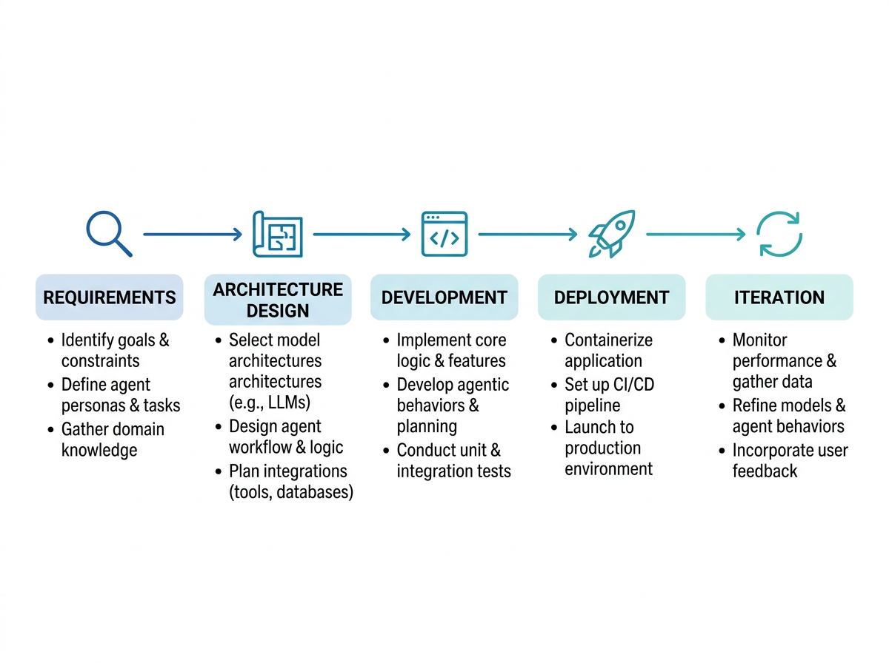

# 从0到1构建完整Agent应用

学习Agent技术最大的障碍不是缺少概念解释，而是缺少完整项目的实战经验。你知道ReAct框架的原理，了解工具调用的机制，看过RAG的架构图——但当面对一个真实业务需求时，怎么把这些碎片知识组装成一个可运行、可交付、可持续迭代的产品？本文将带你走完从需求到迭代的完整流程，不是理论概述，而是每个阶段的实战决策和方法。

## 需求定义：把模糊想法变成清晰边界

Agent项目的需求定义和传统软件开发有本质区别——传统软件的需求是确定性的功能规格，Agent项目的需求是能力范围和约束条件。

### 从业务痛点出发

不要从技术出发（"我要做一个RAG Agent"），要从业务痛点出发：

- **痛点访谈**：和业务方深入对话，了解他们现在怎么做事、哪里最耗时、哪里最容易出错、哪里最依赖个人经验。痛点不是"需要AI"，而是"新员工要花3天才能找到正确的操作流程文档"。
- **场景限定**：把痛点限定到具体场景。"知识检索效率低"太宽泛，"新员工查找操作流程文档平均耗时3天"才是可定义的场景。场景越具体，Agent的能力边界越清晰。
- **成功指标定义**：定义清晰的成功指标——"查找操作流程文档的平均耗时从3天降到30分钟"，而不是"提升知识检索效率"。可量化的指标让项目效果可评估、迭代方向可验证。

### 能力边界划定

Agent不是万能的，需求定义时必须明确划定能力边界：

- **能做什么**：Agent可以理解自然语言查询、检索知识库、生成结构化回答、引用原文溯源。
- **不能做什么**：Agent不能处理知识库中没有的信息、不能保证100%准确、不能替代专业判断做高风险决策。
- **什么时候说不**：当用户的问题超出知识库覆盖范围、当回答涉及高风险决策（如医疗诊断建议、法律判断）、当检索结果不足以生成可信回答时，Agent应该明确说"我不知道"而不是猜测。

清晰的边界声明不是能力限制，而是信任基础。用户知道Agent的边界才能正确使用它，而不是在不适合的场景中期待不可能的结果。

## 架构设计：选择合适的模式

Agent架构不是越复杂越好，而是越适合场景越好。

### 单Agent vs 多Agent

第一个架构决策：用单Agent还是多Agent协作？

- **单Agent适用场景**：任务链路相对线性、工具集可控、决策点不多。大多数知识库问答、数据分析、简单运维场景都适合单Agent。单Agent的优势是实现简单、调试方便、推理链路清晰。
- **多Agent适用场景**：任务需要不同专业能力协作、子任务可以独立并行、单个Agent的工具集过大导致选择困难。复杂的研发项目（需求分析+架构设计+代码生成+测试生成各需要不同专业能力）适合多Agent分工。
- **决策原则**：先尝试单Agent方案。当单Agent的工具数量超过15-20个导致工具选择准确率下降，或任务链路需要频繁切换不同专业视角时，才考虑多Agent拆分。

### 记忆系统设计

Agent是否需要记忆系统，需要哪种记忆：

- **无记忆**：每次对话独立处理，适合一次性任务场景（如单次数据分析查询）。
- **对话记忆**：记住当前对话的上下文，支持多轮交互，适合交互式问答和渐进式分析。大多数Agent应用至少需要对话记忆。
- **用户记忆**：记住用户的历史偏好、常用查询模式、知识水平，适合个性化服务场景。实现成本较高，只在明确需要个性化时引入。
- **知识记忆**：从历史交互中提取可复用的知识模式（如常见问题及其最佳回答模式），适合高频重复问题的场景。

不要默认使用最复杂的记忆方案。从对话记忆开始，按需求逐步升级。

### 工具集设计

工具是Agent的手脚，工具集设计直接决定Agent的能力范围：

- **工具命名与描述**：工具的名称和描述是Agent选择工具的唯一依据。命名要语义明确（query_database而非execute_sql），描述要包含使用场景、输入格式、输出格式、限制条件。模糊的工具描述会导致Agent频繁选错工具。
- **工具粒度**：工具粒度太粗（一个万能数据分析工具）让Agent无法精确控制操作，粒度太细（几十个微操作工具）让Agent选择困难。合适的粒度是一个工具对应一个明确的业务操作——查询数据库、生成图表、发送通知。
- **错误反馈设计**：每个工具执行失败时应该返回结构化错误信息——错误类型、错误原因、建议修正方式。Agent根据错误反馈调整策略重试，而不是在失败后盲目重试。

## 开发实现：关键工程实践

### Prompt工程分层

不要试图用一个巨型Prompt解决所有问题。分层设计：

- **系统Prompt**：定义Agent的角色、能力范围、行为约束、输出格式。这是不变的底层配置。
- **任务Prompt**：针对当前具体任务的指令——分析什么数据、回答什么问题、执行什么操作。这是随任务变化的中间层。
- **工具调用Prompt**：每次工具调用的参数构造和结果解读指令。这是最动态的顶层。

三层分离让每层可以独立优化，而不是每次调整都重写整个Prompt。

### 测试策略

Agent应用的测试比传统软件更困难——输出不确定但必须质量可控：

- **Golden Test**：为典型场景定义期望的输出模式（不是精确文本匹配，而是结构化模式匹配——回答应该包含哪些要点、引用哪些来源、遵循什么格式）。
- **对抗测试**：专门测试Agent在边界情况的表现——超出能力范围的问题、恶意引导的输入、格式异常的数据。对抗测试暴露系统的薄弱环节。
- **回归测试**：每次Prompt或工具修改后，用固定测试集验证核心场景的表现没有退化。Agent应用的修改经常在修复一个场景时破坏另一个场景，回归测试是防线。

### 可观测性设计

Agent应用的运行过程必须可观测：

- **推理链路记录**：记录Agent的每一步推理——问题理解、工具选择、工具调用结果、推理推导、回答生成。完整的推理链路是调试和优化的基础。
- **关键指标监控**：工具调用成功率、平均推理步数、用户满意度评分、回答引用准确率。这些指标是系统健康度的仪表盘。
- **异常检测**：推理步数异常增多（可能陷入循环）、工具调用频繁失败（可能工具配置问题）、回答引用率骤降（可能检索质量退化）。实时异常检测让问题在用户感知之前被发现。

## 部署上线：从开发环境到生产环境

Agent部署不是简单地把代码推到服务器，而是需要解决一系列生产环境特有的问题。

### 性能与成本

- **推理延迟优化**：用户等待超过5秒体验就明显下降。优化策略包括：流式输出让用户实时看到进展、预热模型减少首次响应延迟、缓存高频查询的检索结果和回答。
- **成本控制**：Agent的每次推理都消耗模型调用成本。控制策略包括：简单查询用轻量模型处理、复杂查询才调用重量模型、对重复查询做结果缓存、设定每用户每日调用上限。
- **弹性伸缩**：流量高峰需要更多推理资源。方案包括：模型推理服务做容器化部署支持快速扩容、预置推理资源池应对预期高峰、设置排队机制防止资源耗尽。

### 安全与权限

- **输入安全**：防止Prompt注入攻击——在系统Prompt中设置强约束、对用户输入做关键词过滤、分离系统指令和用户输入的层级。
- **输出安全**：防止Agent输出敏感信息——对回答做后处理过滤、对工具调用结果做脱敏处理、限制Agent可访问的数据范围。
- **操作权限**：Agent的工具调用必须有权限控制——读取操作可以较宽松，修改操作必须严格限制，删除操作需要人工确认。

## 持续迭代：上线只是起点

Agent应用上线后的迭代比上线前的开发更重要——真实用户的使用模式和预期假设之间的差距才是优化的真正方向。

### 数据驱动的迭代

- **用户反馈收集**：每次交互后收集反馈——回答是否有帮助、信息是否准确、交互是否顺畅。反馈数据是迭代优先级的决策依据。
- **质量问题分类**：把质量问题分类——检索不准确、推理逻辑错误、输出格式不佳、交互体验不好。不同类别的问题需要不同的优化策略。
- **迭代优先级**：优先解决高频高影响问题——检索质量问题影响所有场景，优先解决；特定场景的格式问题影响范围小，可以延后。

### Prompt优化循环

Prompt优化不是一次性工作，而是持续循环：

- **问题定位**：从推理链路记录和用户反馈定位具体问题点——是哪一步推理出了偏差，是哪个工具调用结果被误读，是哪个输出约束没有生效。
- **针对性调整**：只调整与问题直接相关的Prompt部分，而不是全量重写。每次调整只改一个变量，这样才能准确评估调整效果。
- **效果验证**：调整后在回归测试集和近期真实案例上验证效果。确认改进有效且无副作用后才正式上线。

### 系统进化方向

Agent应用的长远进化方向：

- **能力扩展**：根据用户需求逐步添加新工具和新能力，而不是一开始就堆砌所有功能。
- **专业化深化**：在核心场景上持续深化Agent的专业能力——更准确的检索、更精确的推理、更贴合场景的输出格式。
- **自学习机制**：从历史成功案例中自动学习和优化——提取高频问题的最优回答模式、更新工具调用的成功率统计、调整检索策略的权重参数。

从0到1构建Agent应用是一个系统工程——需求定义、架构选择、工程实现、部署运维、持续迭代，每个环节都需要实战决策而非理论套用。记住：做出一个能跑的Agent不难，做出一个可靠的、有用的、持续进化的Agent产品才难。而这个"才难"的部分，只能通过实战来学习。
---

## 本章小结

Agent 应用开发五阶段：
1. **需求定义**：从业务痛点出发，划定能力边界，定义成功指标
2. **架构设计**：单/多 Agent、记忆系统、工具集——适合场景的才是最好的
3. **开发实现**：Prompt 分层、测试策略（Golden + 对抗 + 回归）、可观测性
4. **部署上线**：延迟优化、成本控制、弹性伸缩、安全权限
5. **持续迭代**：数据驱动、Prompt 优化循环、系统进化

**核心原则**：做出能跑的 Agent 不难，做出可靠的、有用的、持续进化的 Agent 产品才难。

---

> 📖 **延伸阅读**
>
> 1. [The Full-Stack LLM Bootcamp](https://fullstackdeeplearning.com/llm-bootcamp/) —— LLM 应用开发完整课程
> 2. [Building LLM Systems](https://www.oreilly.com/library/view/designing-machine-learning/9781098107956/) —— 机器学习系统设计
> 3. [AI Engineer Summit](https://www.youtube.com/@aiDotEngineer) —— AI 工程师社区视频
> 4. [Patterns for Building LLM-based Systems](https://eugeneyan.com/writing/llm-patterns/) —— LLM 系统设计模式
