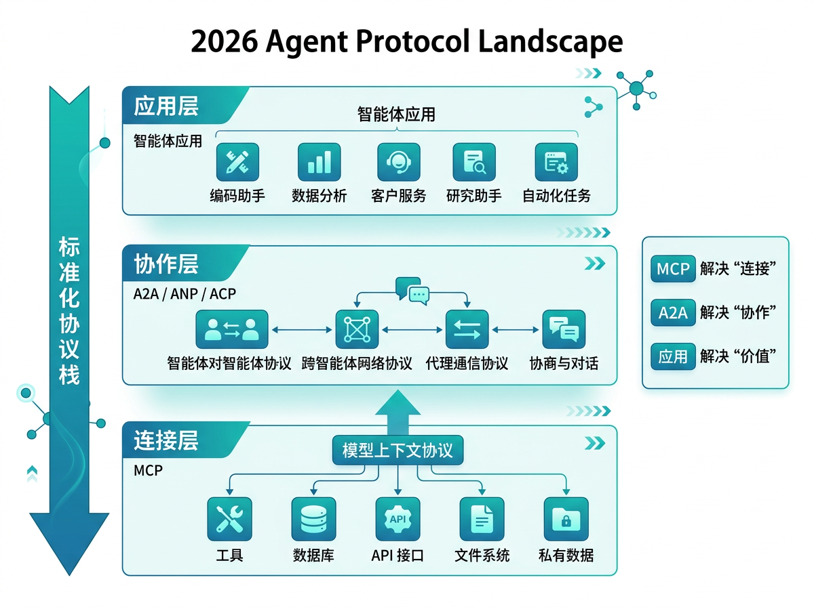

# MCP生态演进

Model Context Protocol（MCP）正在成为Agent生态中"工具层"的基建协议。理解MCP的演进路径，不仅是理解一个协议的技术细节，更是理解**Agent开发范式的结构性转变**——从"每个Agent自己集成一切"到"工具作为共享基础设施按需接入"。

## MCP协议的核心定位

MCP由Anthropic在2024年底正式发布，其设计目标简洁而深远：**为LLM应用与外部数据源、工具之间建立一个开放、标准化的连接协议**。

在MCP之前，Agent调用外部工具的方式是"各自封装"——每个Agent框架（LangChain、AutoGPT、CrewAI等）都有自己的工具定义格式、注册方式和调用机制。一个工具开发者如果要让自己的工具被多个框架使用，需要为每个框架写一个适配器。这就像在USB标准出现之前，每个手机厂商都有自己的充电接口——用户痛苦，厂商也痛苦。

MCP的核心概念模型是**Client-Server架构**：LLM应用（如Claude Desktop、IDE插件）作为Client，通过MCP协议向Server请求工具、资源和Prompt模板。Server可以是任何提供MCP接口的服务——数据库连接器、文件系统接口、Web搜索服务、代码分析工具等。Client与Server之间通过JSON-RPC 2.0通信，支持三种交互模式：**工具调用（Tools）**——请求Server执行操作并返回结果；**资源读取（Resources）**——获取Server提供的数据内容；**Prompt模板（Prompts）**——获取Server预定义的提示词模板。

## Server生态的扩张路径

MCP生态的扩张速度远超预期。从发布至今，Server生态已经覆盖了以下核心类别：

**数据与存储类Server**——PostgreSQL、SQLite、Redis等数据库的直接访问接口，让Agent无需通过中间API即可查询和操作数据。这对数据分析Agent、运维Agent是基础能力。关键价值：Agent不再是"只能调用REST API"的受限角色，而是可以直接与数据基础设施交互的参与者。

**开发工具类Server**——Git操作、文件系统读写、代码执行环境等，为编程Agent提供了完整的开发工具链。SWE-Agent的成功已经证明，为Agent提供精确的开发接口远比让它模拟人类操作终端更有效。MCP的Git Server正是这一理念的协议化实现。

**通信与协作类Server**——Slack、Email、日历等通信工具的接口，让Agent能够读写消息、管理日程、参与协作流程。这是Agent从"独立工作者"走向"团队参与者"的关键桥梁。

**搜索与信息类Server**——Web搜索、知识库查询、文档检索等，为Agent的信息获取提供标准化入口。不同于传统API封装，MCP Server可以直接返回结构化的搜索结果，减少Agent对网页内容的二次解析开销。

**企业内部类Server**——这是生态中最具实际价值但最低调的部分。企业内部的ERP接口、CRM查询、工单系统等，通过MCP Server封装后，任何兼容MCP的Agent应用都可以直接接入——无需为每个Agent单独开发集成层。

## 工具标准化进程的关键挑战

MCP的标准化进程并非一帆风顺，当前面临几个关键挑战：

**认证与权限管理**——MCP协议本身不包含认证机制，Server的访问控制依赖各自的实现。当一个Agent同时连接多个Server时，如何统一管理不同Server的权限范围？例如，一个Agent可以读数据库但不能写数据库，可以搜索Web但不能发送Email——这些权限边界需要在Client侧集中管理，而当前尚无标准化的权限框架。

**Server发现与注册**——当前的MCP生态依赖人工配置——用户需要手动在每个Client中添加Server的连接信息。随着Server数量增长，这种方式显然不可持续。未来需要类似"DNS"的Server发现机制，让Agent能够根据任务需求自动发现和接入合适的Server。

**工具描述的一致性**——MCP要求每个Server提供工具的描述（name、description、inputSchema），但描述的质量和粒度差异很大。一个模糊的工具描述会让Agent误用工具，一个过于复杂的参数Schema会让Agent难以构造正确的调用。**工具描述的质量，直接决定Agent使用工具的可靠性**——这是标准化进程中最被低估的环节。

**多Server编排**——当Agent需要跨多个Server协同完成任务时（如"从数据库查数据、用搜索验证、发邮件汇报结果"），MCP协议本身不提供跨Server的编排能力。编排逻辑仍然在Agent侧实现，但Agent如何高效地规划跨Server的任务流，是一个待解的工程问题。

## 未来展望：从协议到生态

MCP的演进方向可以从三个维度预判：

**基础设施层**——MCP将从"协议规范"演进为"生态基础设施"，包括Server注册中心、权限管理框架、连接池管理、健康检查等。类比HTTP协议从RFC文档演进为整个Web基础设施的过程。

**智能匹配层**——未来的Agent不应需要人工配置"我要连接哪些Server"，而是根据任务语义自动匹配最合适的Server组合。这需要工具语义索引、任务-工具匹配算法、动态Server推荐机制。

**协作层**——当多个Agent通过共享的MCP Server协同工作时，Server本身需要支持并发访问、状态隔离、数据冲突解决等分布式协作能力。这将推动MCP从"Client-Server"走向更复杂的"多Client-多Server"协作网络。

对Agent工程师而言，当下最务实的行动是：**开始为你的业务场景构建MCP Server**。不要等待"完美生态"——在你的企业内部，将最常用的数据源和工具封装为MCP Server，这本身就是对生态的贡献，也是让你的Agent系统从"Demo级集成"迈向"生产级连接"的关键一步。

## 2026：Agent 协议格局

2026 年，Agent 领域的协议栈正在快速分层。理解各层协议的定位与关系，是设计可扩展 Agent 系统的关键。

### 三层协议模型

**连接层：MCP**
MCP 负责标准化 Agent 与外部资源（工具、数据库、文件系统）的连接方式。它解决的是"Agent 如何调用能力"的问题。2026 年 MCP 生态已覆盖数千个 Server，成为事实上的工具连接标准。

**协作层：A2A / ANP / ACP**
这一层解决的是"Agent 如何与其他 Agent 协作"的问题。Google 的 A2A 是目前的领先者，但社区也在探索其他方案：
- **ANP（Agent Network Protocol）**：更注重去中心化和身份自治
- **ACP（Agent Communication Protocol）**：部分云厂商推动的企业级协作协议

这些协议在核心抽象上趋同（都定义了能力发现、任务分发、结果返回），但在认证机制、传输层选择和治理模型上有差异。2026 年的共识是：**协作层协议不会一家独大，但核心概念会收敛**。

**应用层：垂直场景协议**
在连接层和协作层之上，特定领域正在涌现垂直协议：
- **SWE-agent 协议**：代码修复任务的标准化交互格式
- **Browser-use 协议**：网页自动化操作的标准化描述
- **Research-agent 协议**：多步骤研究任务的协作规范

这些垂直协议往往建立在 MCP+A2A 的基础上，针对特定任务类型优化交互效率。

### 协议选型的工程建议

面对快速演进的协议格局，Agent 工程师应采取"抽象隔离"策略：

1. **不要直接在业务代码中依赖具体协议**：将协议交互封装在适配器层，未来切换协议时只需更换适配器
2. **优先拥抱 MCP**：工具连接是 Agent 的刚需，MCP 的生态成熟度已足以支撑生产部署
3. **关注 A2A 但不急于全量采用**：A2A 的互操作价值在多团队、多框架协作场景最明显。单一团队内部使用自定义通信机制可能更简单高效
4. **参与垂直协议的标准化**：如果你在特定领域（如代码生成、数据分析）深耕，考虑将你的任务交互格式提炼为领域协议，回馈社区

**未来预判**：协议栈的分层将推动 Agent 生态从"框架竞争"走向"协议兼容"。就像 HTTP/TCP 分层让 Web 应用摆脱了网络实现的绑定，MCP+A2A 的分层将让 Agent 应用摆脱具体框架的锁定——这才是 Agent 工程真正成熟的标志。
---

## 本章小结

MCP 生态扩张三维度：
1. **基础设施层**：传输协议标准化、Server 发现机制、认证体系
2. **智能匹配层**：工具语义理解、动态能力匹配、上下文自适应
3. **协作网络层**：多 Server 编排、跨平台互操作、社区治理

**关键挑战**：认证标准化、工具质量参差、Server 治理与版本管理。

---

> 📖 **延伸阅读**
>
> 1. [MCP Server 列表](https://github.com/modelcontextprotocol/servers) —— 官方社区 Server 汇总
> 2. [MCP Python SDK](https://github.com/modelcontextprotocol/python-sdk) —— Python 开发工具包
> 3. [npm MCP SDK](https://www.npmjs.com/package/@modelcontextprotocol/sdk) —— TypeScript 开发工具包
> 4. [MCP Inspector](https://github.com/modelcontextprotocol/inspector) —— Server 调试工具
