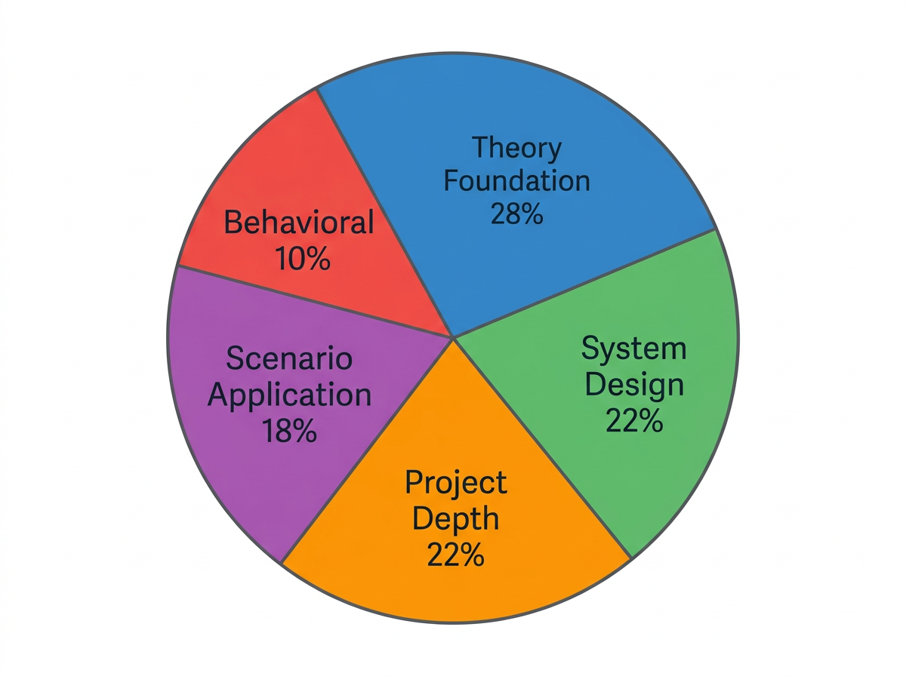

# 面试题型与考点分析

了解面试题型的分布规律和背后考察意图，是高效备考的第一步。不同公司对 AI Agent 岗位的面试侧重点差异明显，掌握这些规律可以帮你把有限的准备时间花在刀刃上。

## 各大厂题型分布概况

通过对百度、阿里、字节、腾讯、美团等一线大厂 AI Agent 相关岗位的面经统计分析，面试题型大致可分为以下五大类：

| 题型 | 平均占比 | 主要考察方向 |
|------|---------|-------------|
| 理论基础题 | 25%-30% | LLM原理、Attention机制、Tokenizer、Prompt Engineering |
| 系统设计题 | 20%-25% | Agent架构设计、多Agent协同、RAG系统搭建 |
| 场景应用题 | 15%-20% | 给定业务场景设计Agent解决方案、工具选择与编排 |
| 项目深度追问 | 20%-25% | 埙人项目的技术细节、架构决策、踩坑经验 |
| 行为面试题 | 10%-15% | 团队协作、冲突处理、学习方式、职业规划 |

值得注意的是，**创业公司和中等规模公司**的项目追问占比往往更高（可达35%），因为他们更看重候选人的实际动手能力和项目落地经验。而**大厂基础研究团队**则理论基础题和系统设计题占比更高，对底层原理的掌握深度要求更严格。

## 理论基础题：不只是背诵

理论基础题看似只需记忆，但面试官的真实考察意图是判断你对原理的理解深度。常见问法包括：

- "请解释 Transformer 中 Self-Attention 的计算过程"——不只要求你说出 Q/K/V 的定义，还期望你能推导注意力矩阵的维度变化，并解释为什么用 Softmax 归一化
- "LLM 的 Tokenizer 有哪些类型？BPE 和 WordPiece 的核心差异是什么？"——考察你对数据预处理的理解，这直接影响你对模型能力和局限的判断
- "Prompt Engineering 中 Chain-of-Thought 的原理是什么？"——不只是说"让模型分步思考"，还期望你能解释这为什么能提升推理能力（与中间步骤的梯度传播、推理链的注意力分配有关）

**应对策略**：对每个核心知识点，准备"定义-推导-直觉解释-工程影响"四层回答结构。例如讲 Attention，先说定义公式，再推导矩阵维度，然后用"信息检索"类比解释直觉，最后说多头注意力在工程上如何并行计算。

## 系统设计题：结构化思维是关键

系统设计题是 AI Agent 面试的重头戏，面试官期望看到你有从需求分析到架构落地的完整思维链条。典型题目如"设计一个客服 Agent 系统"或"设计一个多Agent协作的代码生成平台"。

**应对策略**：采用"需求澄清→核心模块拆分→模块间交互→关键设计决策→优化与演进"的五步框架。特别要主动澄清需求边界——面试官往往会故意给出模糊的场景描述，考验你是否会盲目开工还是先问清约束条件。在模块拆分时，优先说明每个模块的职责边界和数据流向，而非急于选择具体技术栈。

## 场景应用题：展示工程判断力

场景题如"如何为一个电商平台设计商品推荐Agent"、"如何让Agent处理多轮对话中的用户意图切换"等。这类题目考察你将技术方案适配到具体业务的能力。

**应对策略**：先做业务场景的特征分析（用户量、实时性要求、数据特征、容错要求），再匹配技术方案。不要直接抛出答案，而是展示你的决策过程——"考虑到这个场景的实时性要求高，我选择流式RAG而非离线索引方案"。

## 项目深度追问：诚实且有深度

面试官会对你的项目经历进行深度挖掘，问题如"你项目中为什么选择这个架构"、"遇到了什么难点、怎么解决的"、"如果重新做你会怎么改进"。

**应对策略**：对每个写在简历上的项目，准备"做了什么→为什么这么做→遇到什么问题→如何解决→学到了什么→如果重来怎么改进"的完整叙事链。诚实承认不足反而加分——面试官更看重你的反思能力而非完美项目。

## 行为面试题：展现成长性

行为面试题如"你在团队中如何处理技术分歧"、"你如何快速学习一个新技术"、"你最失败的一个项目经历是什么"。

**应对策略**：用 STAR 法则（Situation-Task-Action-Result）结构化回答，在 Result 部分务必加上 Reflection（反思），展示你的成长闭环。避免空泛回答，每个行为题都配合一个具体的技术场景来讲述。
---

## 本章小结

五大面试题型分布：
- **理论基础**（25-30%）：Transformer、注意力机制、Tokenizer
- **系统设计**（20-25%）：Agent 架构、多 Agent 协作、RAG
- **场景应用**（15-20%）：业务案例适配、方案选型
- **项目深度**（20-25%）：技术决策、踩坑经历、优化思路
- **行为面试**（10-15%）：团队协作、冲突处理、成长反思

**公司差异**：大厂重理论+系统设计，创业公司重项目+实操，研究团队重论文+前沿。

---

> 📖 **延伸阅读**
>
> 1. [LeetCode](https://leetcode.com/) —— 算法面试题库
> 2. [System Design Primer](https://github.com/donnemartin/system-design-primer) —— 系统设计面试指南
> 3. [AI 面试题库](https://github.com/zhedongzheng/fantasy-machine-learning) —— 机器学习面试题汇总
> 4. [Behavioral Interview Guide](https://www.amazon.jobs/content/en/our-workplace/interviewing-at-amazon) —— 行为面试 STAR 法则
