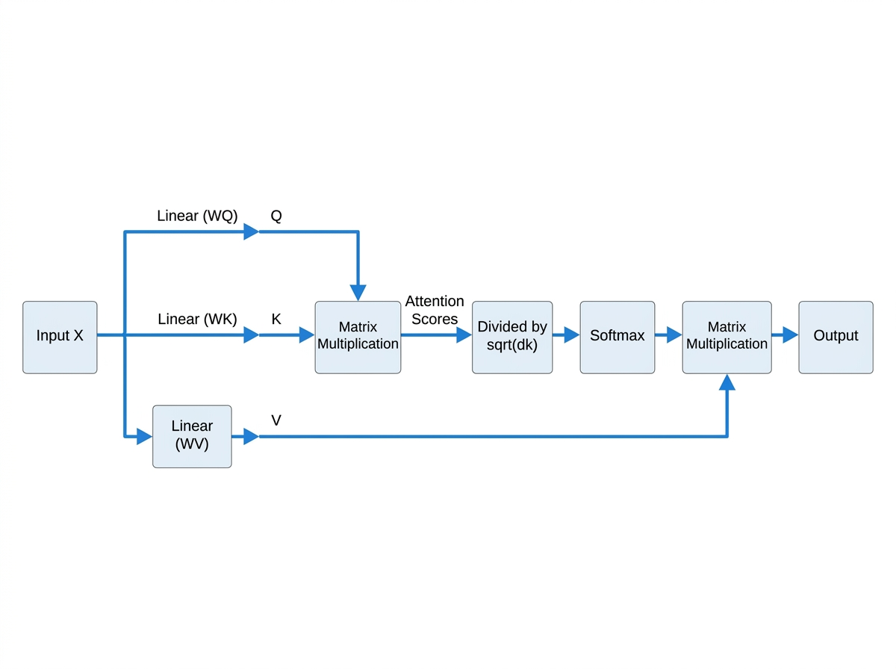
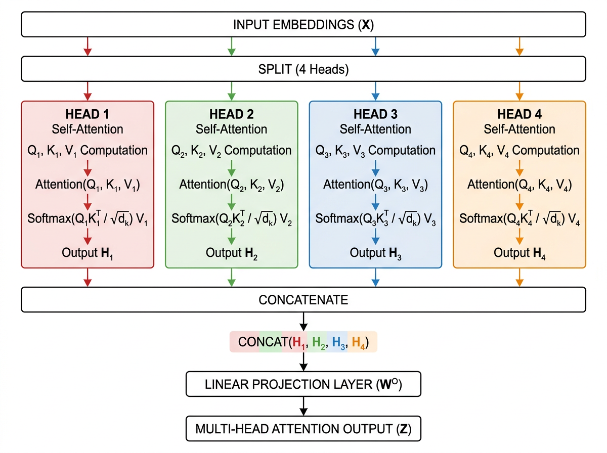

# Transformer 与注意力机制详解

Transformer 架构自 2017 年 Google 提出《Attention Is All You Need》论文以来，已成为大语言模型的统一底座。从 GPT 系列到 Claude、Llama、Qwen，所有主流模型都建立在 Transformer 的变体之上。理解 Transformer 的核心机制，是掌握 LLM 行为模式的第一步。

## 自注意力机制（Self-Attention）



自注意力是 Transformer 最核心的创新。传统 RNN 通过隐藏状态逐步传递信息，难以捕捉长距离依赖；CNN 通过局部窗口提取特征，覆盖范围有限。自注意力则让序列中的每个位置都能**直接**关注到其他任意位置的信息。

其计算过程可以概括为：

1. **线性投影**：将输入向量乘以三个权重矩阵，得到查询（Query）、键（Key）、值（Value）三组向量
2. **注意力得分**：计算 Query 与所有 Key 的点积，衡量每个位置对当前位置的"相关性"
3. **缩放与归一化**：将得分除以 $\sqrt{d_k}$（防止梯度消失），再通过 Softmax 归一化为权重分布
4. **加权求和**：用权重对 Value 向量加权求和，得到当前位置的输出

公式表达为：

$$
\text{Attention}(Q, K, V) = \text{Softmax}\left(\frac{QK^T}{\sqrt{d_k}}\right) V
$$

**直觉理解**：当模型处理"它"这个代词时，自注意力会让 Query 向量去搜索序列中所有 Key，找到与"它"语义最相关的位置（比如前面提到的"猫"），然后从那个位置取回 Value 信息融入当前表示。

## 多头注意力（Multi-Head Attention）



单一注意力头只能学习一种关联模式。多头注意力将 Q、K、V 分别投影到 $h$ 个低维子空间，每个头独立计算注意力，然后将所有头的输出拼接并线性融合。

这意味着模型可以**同时**关注多种语义关系：一个头可能关注语法依赖（主谓关系），另一个头关注语义指代（代词消解），还有一个头关注位置邻近（局部上下文）。

实际参数量并不比单头更多——$h$ 个头的维度为 $d_k = d_{\text{model}} / h$，总计算量与单头等价，但表达能力显著提升。

### 代码示例：PyTorch 实现

以下是用 PyTorch 实现的简化版自注意力，帮助理解计算流程：

```python
import torch
import torch.nn as nn
import math

class SelfAttention(nn.Module):
    def __init__(self, d_model=512):
        super().__init__()
        self.d_model = d_model
        # 三个线性投影层，分别生成 Q、K、V
        self.W_q = nn.Linear(d_model, d_model)
        self.W_k = nn.Linear(d_model, d_model)
        self.W_v = nn.Linear(d_model, d_model)

    def forward(self, x):
        # x: [batch_size, seq_len, d_model]
        Q = self.W_q(x)  # [batch, seq_len, d_model]
        K = self.W_k(x)
        V = self.W_v(x)

        # 注意力得分: Q @ K^T / sqrt(d_k)
        scores = torch.matmul(Q, K.transpose(-2, -1)) / math.sqrt(self.d_model)

        # Softmax 归一化
        attn_weights = torch.softmax(scores, dim=-1)

        # 加权求和: attn @ V
        output = torch.matmul(attn_weights, V)
        return output, attn_weights
```

**关键注意点**：
- 实际实现中会使用 `nn.MultiheadAttention`，它已针对性能做了优化（融合 kernel、内存布局优化）
- 上面的 `scores` 矩阵大小为 `[batch, seq_len, seq_len]`，这就是 $O(n^2)$ 复杂度的来源
- 在 Decoder-Only 模型中，还需要对 `scores` 做**因果掩码**（causal mask），让每个位置只能看到之前的位置

## 位置编码（Positional Encoding）

自注意力机制本身是**位置无关**的——它把序列视为无序的集合。为了让模型感知顺序信息，Transformer 在输入嵌入中叠加了位置编码。

原始 Transformer 使用三角函数编码：

$$
PE_{(pos, 2i)} = \sin(pos / 10000^{2i/d_{\text{model}}})
$$
$$
PE_{(pos, 2i+1)} = \cos(pos / 10000^{2i/d_{\text{model}}})
$$

这种编码有几个重要特性：每个位置有唯一的编码向量；相对位置关系可以通过线性变换表达；可以扩展到训练时未见过的长度。

现代 LLM 更多使用**旋转位置编码（RoPE）**，它通过在二维平面上旋转 Query 和 Key 向量来注入相对位置信息，在长序列外推性上表现更优。Llama、Qwen 等模型均采用 RoPE。

### RoPE 的简化实现

```python
import torch

def apply_rotary_pos_emb(q, k, dim=64):
    """
    简化的 RoPE 实现：对 q 和 k 的最后 dim 维应用旋转位置编码
    q, k: [batch, seq_len, heads, head_dim]
    """
    seq_len = q.shape[1]
    pos = torch.arange(seq_len, device=q.device).float()
    freqs = 1.0 / (10000 ** (torch.arange(0, dim, 2, device=q.device).float() / dim))
    angles = torch.outer(pos, freqs)
    cos = torch.cos(angles)
    sin = torch.sin(angles)

    q_even, q_odd = q[..., ::2], q[..., 1::2]
    q_rot = torch.empty_like(q)
    q_rot[..., ::2] = q_even * cos - q_odd * sin
    q_rot[..., 1::2] = q_even * sin + q_odd * cos

    k_even, k_odd = k[..., ::2], k[..., 1::2]
    k_rot = torch.empty_like(k)
    k_rot[..., ::2] = k_even * cos - k_odd * sin
    k_rot[..., 1::2] = k_even * sin + k_odd * cos

    return q_rot, k_rot
```

RoPE 的核心优势在于：**相对位置关系可以通过简单的矩阵乘法表达**，这使得模型在推理时更容易外推到比训练时更长的序列。

## Transformer 的两大变体

- **Encoder-Decoder 架构**（原始 Transformer、T5）：编码器用双向注意力理解完整输入，解码器用因果注意力逐词生成输出。适合翻译、摘要等"理解后生成"任务。

- **Decoder-Only 架构**（GPT、Claude、Llama、Qwen）：只保留解码器，使用因果（掩码）注意力——每个位置只能看到之前的 token。这种架构天然适配自回归生成，且在足够规模下，单向注意力的理解能力也能逼近双向注意力。当前所有主流 LLM 基本都采用 Decoder-Only 设计。

## 对 Agent 工程的意义

理解 Transformer 的这些机制，对 Agent 工程有直接的指导作用：

- **上下文窗口的限制本质上来自自注意力的 $O(n^2)$ 计算复杂度**——这决定了模型能"看到"多少信息，也决定了你的 prompt 设计需要精炼
- **多头注意力意味着模型在处理你的 prompt 时会同时从多个维度提取信息**——结构化的 prompt（分段、标记、层次）比混沌的文本更利于多头高效工作
- **位置编码决定了模型对 prompt 中信息顺序的敏感度**——把关键指令放在开头或结尾（位置编码最突出的区域）往往效果更好

---

## 本章小结

| 核心概念 | 关键要点 |
|---------|---------|
| **自注意力** | 通过 Q、K、V 三个投影实现序列中任意位置的直接交互，计算复杂度 $O(n^2)$ |
| **多头注意力** | 多组独立的注意力头并行工作，分别捕捉不同语义维度的关联模式 |
| **位置编码** | 原始三角函数编码 → 现代 RoPE 旋转编码，后者在外推性上更优 |
| **架构选择** | 当前主流 LLM 均采用 Decoder-Only 架构，因果掩码确保自回归生成 |
| **Agent 工程启示** | 上下文窗口限制来自 $O(n^2)$ 复杂度；结构化 prompt 利于多头提取；关键信息放首尾效果更好 |

---

> 📖 **延伸阅读**
>
> 1. [Attention Is All You Need](https://arxiv.org/abs/1706.03762) —— Transformer 原论文
> 2. [The Illustrated Transformer](https://jalammar.github.io/illustrated-transformer/) —— Jay Alammar 可视化博客
> 3. [RoFormer: Enhanced Transformer with Rotary Position Embedding](https://arxiv.org/abs/2104.09864) —— RoPE 原论文
> 4. [PyTorch nn.MultiheadAttention 文档](https://pytorch.org/docs/stable/generated/torch.nn.MultiheadAttention.html)